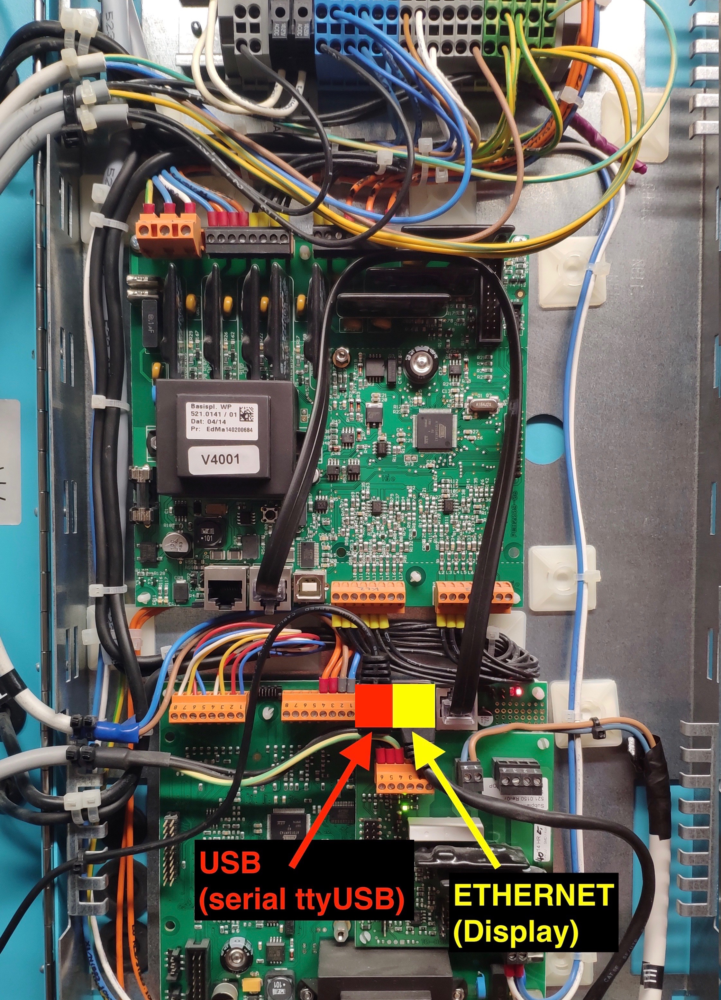

(publishing incomplete/work-in-progress !)

# aerosmartpi
Raspberry Pi based monitoring solution for Aerosmart devices of Drexel und Weiss

## Architecture

D&W mainboard / USB connector is actually a serial interface which can be used to readout and control the entire unit
The protocol and registers are the same as documented for the modbus (900.6666_00_TI_Modbus_Parameter_DE.pdf))

## Workflow

aerosmartpi:
connect Rasperry pi via USB cable to the D&W unit's maintanance USB socket, which is a serial interface.
cronjob triggers aeroserial.py to safely readout the unit and saves output to a file "/var/lib/munin-node/plugin-state/dw.state" (and sdtout)

D&W -> USB -> /dev/USBtty01 -> crontab:\*5m:aeroserial.py -> /var/lib/munin-node/plugin-state/dw.state

fhempi:
A remote Raspberry Pi that hosts fhem is periodically pulling the dw.state file (aeroserial.py output) and make it available for fhem CustomReadings function.

aerosmartpi:/var/lib/munin-node/plugin-state/dw.state -> ssh -> crontab:\*5m:/opt/fhem/dwlog.sh -> /opt/fhem/log/dw-<YYYY-MM>.log -> fhem:CustomReadings

Via fhem a system function can be used to trigger a remote command (aerosmartty.py) on the Aerosmart Pi to control the d&w unit.

fhem:dummy -> define Luefterstufe_3 notify Luefterstufe:3 {system('ssh pi@<aerosmartpi> "/usr/local/bin/aerosmartty.py -t 130 -m 5002 -v 3"');;}

### USB serial connector

## Features

- Open source based visualization and monitoring of Aerosmart devices
- Web based interface (plattform idependent: mac, pc, tablet, smartphone,… )
- minimal costs due to use of embedded Linux  <50EUR!! (prototype runs on Raspberry PI)
- no additional adaption or development required on Aerosmat devices
- no bus adapter required, works via Aerosmart USB connection 

## Status

- full monitoring via munin
- fhem integration (backwardcompatibility to legacy bussystem eg. KNX, Onewire, etc.)
- sync to cloud, access from everywhere
- alarming via mail, triggered by any parameter available in munin
- remote access for support via openvpn
- Smartplug integration to control Infrared panels over WIFI
	- TP-LINK HS100,HS110, HS200
	- EDIMAX Smart Plug Switch SP-1101W

### possible scenarios / follow up development
- native IOS and Android app
   - read access / write access possible with permission of the vendor
- integration into common future home automation IoT
	- Google Nest API
	- Apple Homekit 
	- smartvisu
 
 
## Kitlist
- Raspberry Pi2 
- USB cable: USB-A -> USB-B(90°connector!)  
 

## Screenshots

## Links
https://github.com/diresi/drexel-und-weiss
https://github.com/Bernator/smarthome/tree/develop/plugins/drexelundweiss

